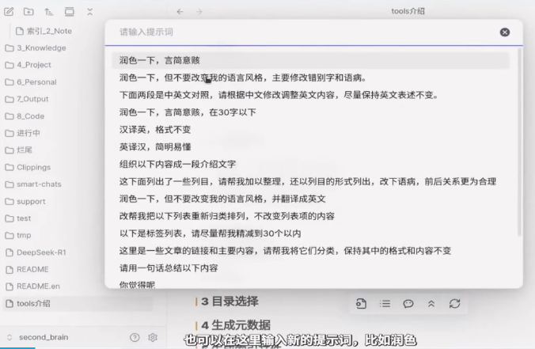

# ExMemo Tools

ExMemo Tools 是一款基于大语言模型（LLM）的 Obsidian 插件，提供智能文档管理和内容优化功能，包含：自动生成元数据、为文件选择位置，使用模型编辑和续写内容等功能。

B站_使用方法视频：

## 主要功能

* 智能文件归档 - 自动推荐合适的目录位置
* 智能内容插入 - 自动定位最佳插入位置
* 元信息管理 - 自动生成标签、描述、标题等元数据
* 目录索引生成 - 创建目录摘要和内容列表
* AI 辅助编辑 - 支持内容优化和文本续写

## 快速开始

### 基础配置

1. 配置 LLM 参数：设置 API 密钥、基础 URL 和模型名称
2. 可选：配置标签列表或从仓库自动提取标签
3. 可选：自定义描述生成的提示词
4. 建议：对长文档启用"内容截断"以控制 API 调用成本

### 核心功能

**生成元信息** (Ctrl+P > ExMemo Tools: 生成元数据)
- 自动生成标签、描述、标题、类别、日期等元数据
- 支持已有元数据的增量更新

**目录索引** (右键目录 > ExMemo 生成目录索引)
- 生成目录结构和内容摘要
- 自动提取和汇总标签

**智能归档** (Ctrl+P > ExMemo Tools: 为当前文件选择合适的目录)
- 基于文件内容推荐最适合的目录
- 支持目录过滤和路径补全

**内容管理** (Ctrl+P > ExMemo Tools: 将选中的文本插入/智能编辑/续写)
- 智能定位插入位置
- AI 辅助内容编辑（多提示词管理）
- 上下文感知的文本续写

## License

GNU Lesser General Public License v3.0，详见 [LICENSE](./LICENSE)。

